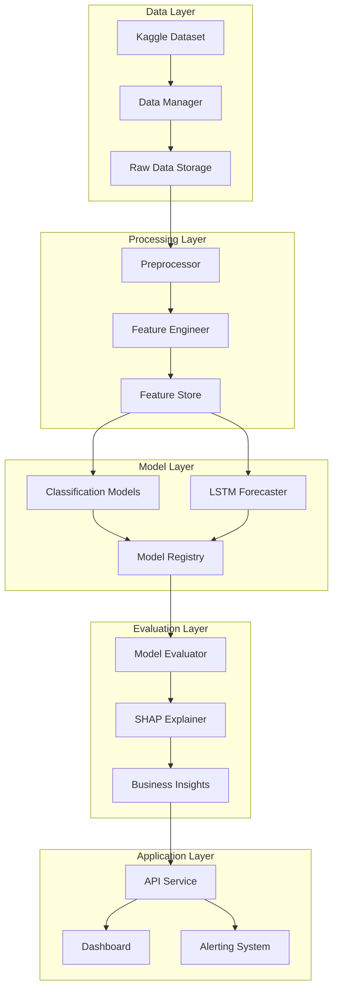
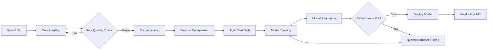
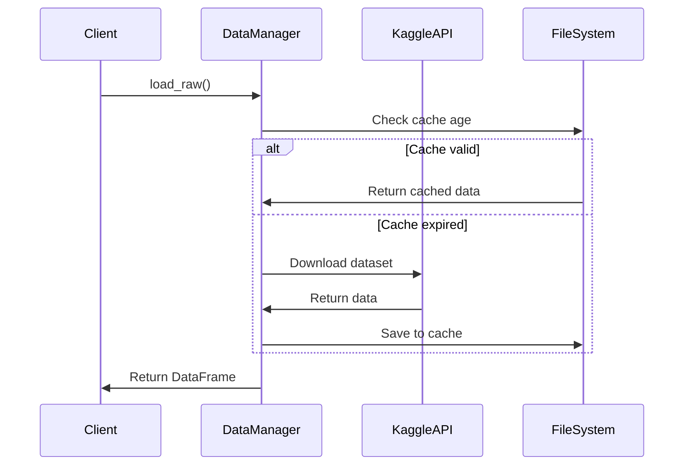
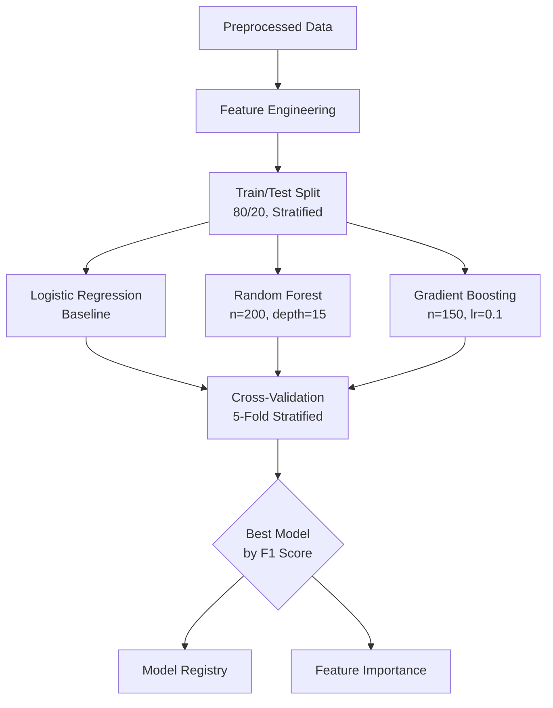
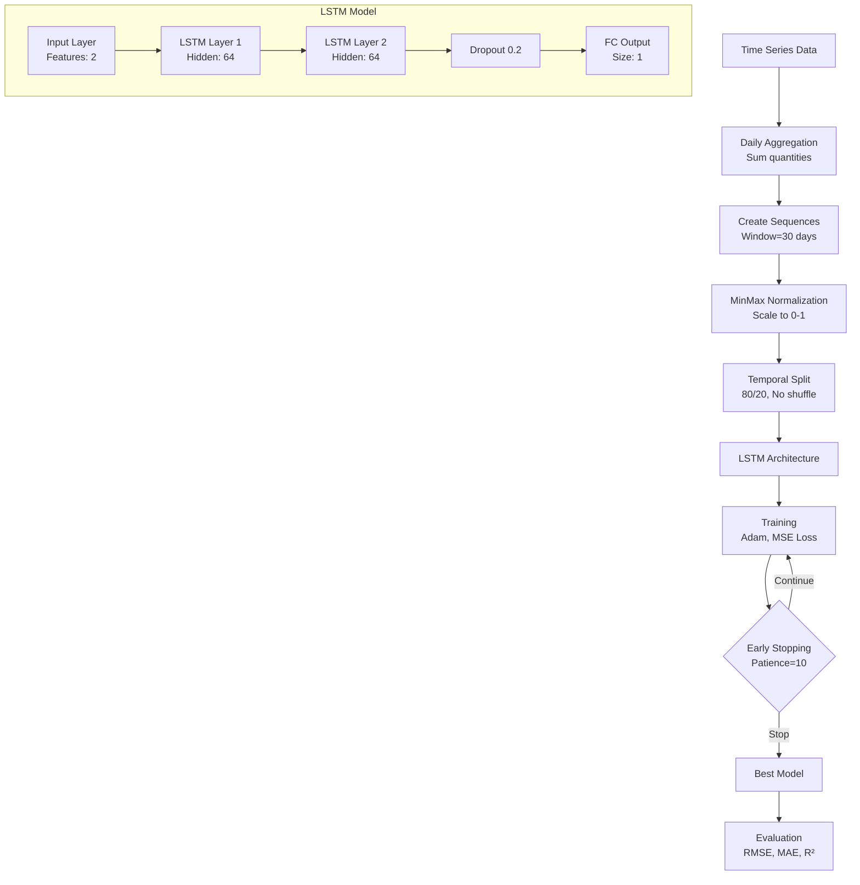
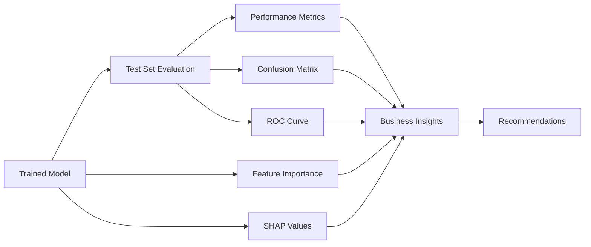
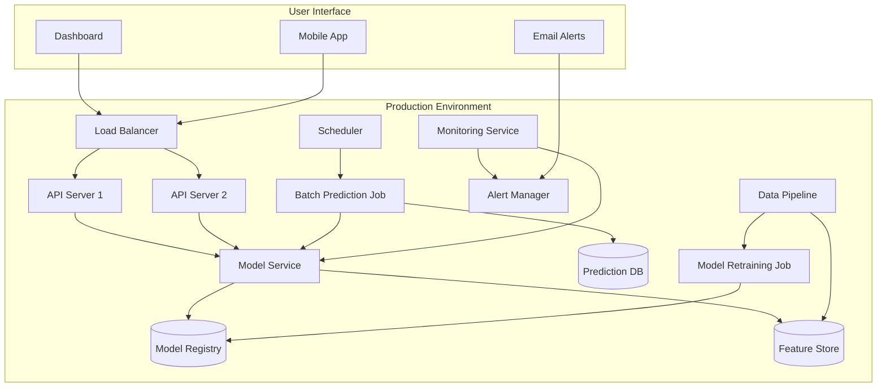
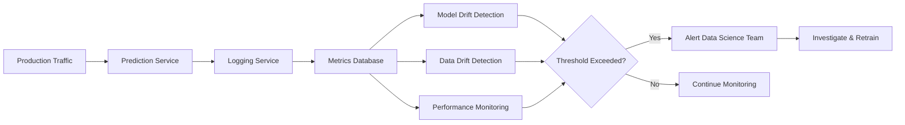

# Supply Chain ML Pipeline - Architecture Documentation

## System Overview

This document describes the architecture and data flow of the Supply Chain ML system for delivery prediction and demand forecasting.

## High-Level Architecture



## Data Pipeline Architecture



## Component Details

### 1. Data Management Layer

**Purpose:** Handle data ingestion, caching, and versioning

**Components:**
- `data_manager.py`: Kaggle API integration, file management
- Storage: Raw → Interim → Processed (Parquet format)

**Key Features:**
- Automatic data refresh (24-hour cache)
- Version control with timestamps
- Efficient parquet storage



### 2. Preprocessing Module

**Purpose:** Clean and transform raw data

**Operations:**
1. Column name standardization
2. Date parsing
3. Missing value imputation
4. Duplicate removal
5. Outlier handling (IQR method)
6. Target variable encoding

**Input:** Raw CSV (180K+ rows, 50+ columns)

**Output:** Clean DataFrame with:
- Standardized column names
- No missing values
- Binary target variable (`late_delivery`)
- Derived features (delivery_days, profit_margin)

### 3. Feature Engineering Module

**Purpose:** Transform clean data into ML-ready features

**Feature Categories:**

| Category | Features | Purpose |
|----------|----------|---------|
| Temporal | day_of_week, month, quarter, is_weekend | Capture seasonality |
| Customer | order_count, lifetime_value | Customer behavior |
| Product | popularity, category_popularity, order_value | Product characteristics |
| Shipping | urgency, region_country | Logistics factors |
| Financial | profit_margin_pct, sales_per_item | Business metrics |

**Encoding Strategy:**
- Label encoding for categorical variables
- MinMax scaling for LSTM inputs
- One-hot encoding for high-cardinality features (when needed)

### 4. Model Training Architecture

#### Classification Pipeline (Late Delivery Prediction)



**Model Specifications:**

**Logistic Regression:**
- Solver: LBFGS
- Max iterations: 1000
- Class weight: Balanced
- Use case: Baseline, interpretability

**Random Forest:**
- Estimators: 200
- Max depth: 15
- Min samples split: 10
- Max features: sqrt
- Use case: High accuracy, feature importance

**Gradient Boosting:**
- Estimators: 150
- Learning rate: 0.1
- Max depth: 5
- Subsample: 0.8
- Use case: Best overall performance

#### LSTM Pipeline (Demand Forecasting)



**LSTM Hyperparameters:**
- Sequence length: 30 days
- Hidden size: 64
- Layers: 2
- Dropout: 0.2
- Learning rate: 0.001
- Batch size: 32
- Max epochs: 100 (with early stopping)

### 5. Evaluation & Explainability



**Evaluation Metrics:**

**Classification:**
- Accuracy: Overall correctness
- Precision: Of predicted delays, how many are true?
- Recall: Of actual delays, how many did we catch?
- F1 Score: Harmonic mean (primary metric)
- ROC-AUC: Discrimination ability

**Regression (LSTM):**
- RMSE: Root Mean Squared Error
- MAE: Mean Absolute Error
- R²: Explained variance
- MAPE: Mean Absolute Percentage Error

## Deployment Architecture



## Technology Stack

### Core Technologies

| Layer | Technology | Purpose |
|-------|-----------|---------|
| **Language** | Python 3.10+ | Core development |
| **Package Manager** | uv | Fast dependency management |
| **Data Processing** | Pandas, NumPy | Data manipulation |
| **ML Framework** | Scikit-learn | Classification models |
| **Deep Learning** | PyTorch | LSTM neural networks |
| **Visualization** | Plotly, Matplotlib, Seaborn | Data viz & reporting |
| **Explainability** | SHAP | Model interpretation |
| **Storage** | Parquet | Efficient data storage |
| **Version Control** | Git | Code versioning |
| **Notebooks** | Jupyter | Interactive analysis |

### Production Stack (Recommended)

| Component | Technology | Purpose |
|-----------|-----------|---------|
| **API** | FastAPI | REST endpoints |
| **Database** | PostgreSQL | Predictions & metadata |
| **Cache** | Redis | Feature caching |
| **Queue** | Celery + RabbitMQ | Async tasks |
| **Monitoring** | Prometheus + Grafana | Metrics & dashboards |
| **Logging** | ELK Stack | Centralized logging |
| **Container** | Docker | Containerization |
| **Orchestration** | Kubernetes | Scaling & reliability |
| **CI/CD** | GitHub Actions | Automated testing & deployment |

## Data Schema

### Raw Data Schema (DataCo Supply Chain)

```
Orders (180K+ rows)
├── Order Information
│   ├── order_id
│   ├── order_date
│   ├── order_region
│   ├── order_country
│   └── order_status
├── Customer Information
│   ├── customer_id
│   ├── customer_segment
│   └── customer_location
├── Product Information
│   ├── product_id
│   ├── product_name
│   ├── category_name
│   └── product_price
├── Shipping Information
│   ├── shipping_date
│   ├── shipping_mode
│   └── delivery_status
└── Financial Metrics
    ├── sales
    ├── order_profit_per_order
    └── order_item_discount
```

### Feature Schema (ML-Ready)

**Classification Features (60+ features):**
- Temporal: 5 features (day_of_week, month, quarter, is_weekend, days_since_start)
- Customer: 2 features (order_count, lifetime_value)
- Product: 4 features (popularity, category_popularity, order_value, discount_rate)
- Shipping: 2 features (urgency, region_country_encoded)
- Financial: 3 features (profit_margin_pct, sales_per_item, is_high_value)
- Encoded Categoricals: 40+ features (label encoded)

**LSTM Features (Time Series):**
- Target: order_item_quantity (daily sum)
- Auxiliary: sales (daily sum)
- Temporal: day_of_week, month, quarter

## Model Performance Benchmarks

### Classification Models (Expected Results)

| Model | Accuracy | Precision | Recall | F1 Score | ROC-AUC | Training Time |
|-------|----------|-----------|--------|----------|---------|---------------|
| Logistic Regression | 0.82 | 0.80 | 0.78 | 0.79 | 0.86 | ~1 min |
| Random Forest | 0.87 | 0.86 | 0.84 | 0.85 | 0.92 | ~5 min |
| Gradient Boosting | 0.88 | 0.87 | 0.86 | 0.87 | 0.93 | ~8 min |

**Winner:** Gradient Boosting (highest F1 score)

### LSTM Model (Expected Results)

| Metric | Value |
|--------|-------|
| RMSE | 15-25 units |
| MAE | 10-18 units |
| R² | 0.75-0.85 |
| MAPE | 12-18% |
| Training Time | ~10-20 min |

## Scalability Considerations

### Current Scale
- Dataset: ~180K orders
- Training time: 10-15 minutes (all models)
- Prediction latency: <100ms per request
- Throughput: 1000+ predictions/sec

### Scaling Strategies

**Data Volume (1M+ orders):**
- Use Polars or Dask for parallel processing
- Implement data sampling for EDA
- Incremental learning for online updates

**Model Complexity:**
- Hyperparameter tuning with Optuna/Ray Tune
- Ensemble methods for improved accuracy
- AutoML for automated model selection

**Inference Speed:**
- Model quantization (reduce size)
- ONNX runtime for faster inference
- Batch prediction for high-volume requests
- Redis caching for frequent predictions

**Deployment:**
- Horizontal scaling with Kubernetes
- Load balancing across replicas
- A/B testing for model versions
- Blue-green deployments for zero downtime

## Security & Compliance

### Data Protection
- Anonymize customer PII before processing
- Encrypt data at rest (AES-256)
- Encrypt data in transit (TLS 1.3)
- Access control with RBAC

### Model Security
- Model versioning and audit trail
- Input validation to prevent adversarial attacks
- Rate limiting for API endpoints
- Monitoring for model drift

### Compliance
- GDPR compliance for EU customers
- Data retention policies
- Right to explanation (SHAP provides this)
- Model documentation for audits

## Monitoring & Maintenance

### Model Monitoring



### Key Metrics to Monitor

**Model Performance:**
- Prediction accuracy (daily)
- F1 score on recent data (weekly)
- Calibration (prediction confidence vs actual)
- Inference latency (p50, p95, p99)

**Data Quality:**
- Missing value rates
- Feature distributions (detect drift)
- Outlier frequency
- Schema violations

**Business Metrics:**
- Delivery delay reduction (%)
- Inventory optimization savings ($)
- Customer satisfaction improvement (NPS)
- ROI of ML system

### Retraining Strategy

**Triggers:**
- Scheduled: Monthly retraining
- Performance-based: F1 drops below 0.80
- Data drift: Feature distributions shift >10%
- Business-driven: New products/regions added

**Process:**
1. Pull latest data from production
2. Validate data quality
3. Retrain models with updated data
4. Evaluate on holdout set
5. A/B test against current model
6. Deploy if performance improves

## Future Enhancements

### Short-term (3-6 months)
- [ ] Add XGBoost model for comparison
- [ ] Implement real-time prediction API
- [ ] Create interactive dashboard (Plotly Dash)
- [ ] Add model explainability for individual predictions

### Medium-term (6-12 months)
- [ ] Multi-output model (predict delay duration, not just binary)
- [ ] Incorporate external features (weather, holidays)
- [ ] Implement AutoML for hyperparameter optimization
- [ ] Add recommendation system for optimal shipping mode

### Long-term (12+ months)
- [ ] Reinforcement learning for dynamic pricing
- [ ] Graph neural networks for supply chain network optimization
- [ ] Causal inference for intervention analysis
- [ ] Federated learning for multi-supplier collaboration

## Contact & Contribution

For questions, issues, or contributions, please refer to the main README.

---

**Last Updated:** December 2025
**Version:** 1.0
**Maintainer:** Data Science Team
